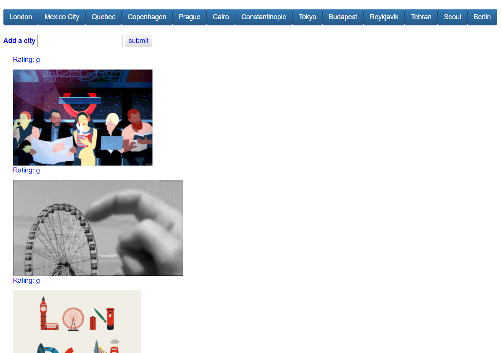

# :movie_camera: GifTastic

### Overview

This is fun app that uses HTML, CSS and Jquery to run API make a dynamic web page. The app uses giphy.com for the API calls.  The call returns 10 gifs and list them in order on the page.  This project helped me understand the asynchronous nature of ajax calls, plus it sharpened my jQuery skills.  I also learned more about how to organize code more so it is readable as well as easier to debug.

### Functionality

1.  Users can clicked on the themed "city" array and see Gifs that relate to that city.
2.  To turn up the fun, users can click on each Gif to animnate it.
3.  As if it could not get any more awesome, users can also add their own cities!

### Screenshot

